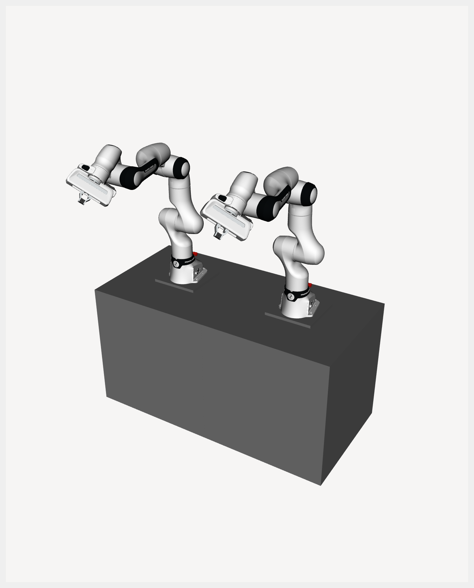

# FR3 ROS 2 Workspace

## Table of Contents
- [Dependencies](#dependencies)
- [Installation](#installation)
- [Package Descriptions](#package-descriptions)
  - [fr3_description](#fr3_description)
  - [fr3_controller](#fr3_controller)
- [MuJoCo Simulation](#mujoco-simulation)
- [Notes](#notes)

---

## Dependencies

### Required apt Packages
- [ROS2 Humble](https://docs.ros.org/en/humble/index.html)
- [libfranka](https://frankarobotics.github.io/docs/libfranka/docs/installation.html) (Install it without franka_ros2 & franka_description!)

### Required Source Dependencies
- [franka_ros2](https://github.com/JunHeonYoon/franka_ros2) - it includes multi_hardware_interface
- [franka_description](https://github.com/JunHeonYoon/franka_description) - it includes multi_hardware_interface URDF
- [mujoco_ros_hardware](https://github.com/JunHeonYoon/mujoco_ros_hardware) - for MuJoCo simulation (optional)

---

## Installation

1. Clone this repository into your ROS 2 workspace:
```bash
cd ~/ros2_ws/src
git clone https://github.com/JunHeonYoon/franka_fr3.git
```

2. Install dependencies with `rosdep`:
```bash
cd ~/ros2_ws
rosdep update
rosdep install --from-paths src --ignore-src -r -y
```

3. Build:
```bash
cd ~/ros2_ws
colcon build --symlink-install --packages-up-to \
  fr3_description \
  fr3_controller
```

4. Source workspace:
```bash
source ~/ros2_ws/install/setup.bash
```

---

## Package Descriptions

### `fr3_description`
- Contains FR3 robot descriptions (`xacro`, mesh, RViz configs).
- Supports single-arm and dual-arm configurations.
```bash
# FR3 visualization (optionally with mobile base)
ros2 launch fr3_description visualize_fr3.launch.py \
  robot_side:=left load_gripper:=true

```
- Main launch arguments:
  - `robot_side`: `left`, `right`, `dual`
  - `load_gripper`: `true|false`

| Single FR3                     | Dual FR3                      |
| ------------------------------ | ----------------------------- |
|   |     |


### `fr3_controller`
- Provides `ros2_control` controller plugins for:
  - FR3 test controller
- Includes launch files for running controller manager, RViz and gripper launch.
- Exported controller plugin types:
  - `fr3_controller/TestFr3Controller`
- Launch files (add `use_mujoco:=true` for simulation — see [MuJoCo Simulation](#mujoco-simulation)):
```bash
# FR3 controller
ros2 launch fr3_controller fr3_controller.launch.py \
  robot_side:=left load_gripper:=true load_mobile:=false use_fake_hardware:=true controller_name:=test_fr3_controller
```

- Main launch arguments:
  - `robot_side`: `left`, `right`, `dual`
  - `namespace`: ROS namespace
  - `controller_name`: base name of the controller to spawn (prefixed with `left_`/`right_`/`dual_` automatically); default `test_fr3_controller`
  - `load_gripper`: `true|false`
  - `use_fake_hardware`: `true|false`
  - `fake_sensor_commands`: `true|false`
  - `use_mujoco`: `true|false`

- To add a new controller plugin, use the code-generation script — see [GENERATE_CONTROLLER.md](fr3_controller/GENERATE_CONTROLLER.md).


## MuJoCo Simulation

All controller launch files support `use_mujoco:=true` to run in MuJoCo instead of real or fake hardware. See [MUJOCO.md](MUJOCO.md) for supported combinations, scene files, and launch argument details.

```bash
# FR3 in MuJoCo (quick start)
ros2 launch fr3_controller fr3_controller.launch.py \
  robot_side:=left load_gripper:=true load_mobile:=false use_mujoco:=true
```

---

## Notes
- Default FR3 IPs in launch files are hardcoded:
  - left arm: `172.16.5.5`
  - right arm: `172.16.6.6`
- For real hardware, verify network setup and safety conditions before launching controllers.
